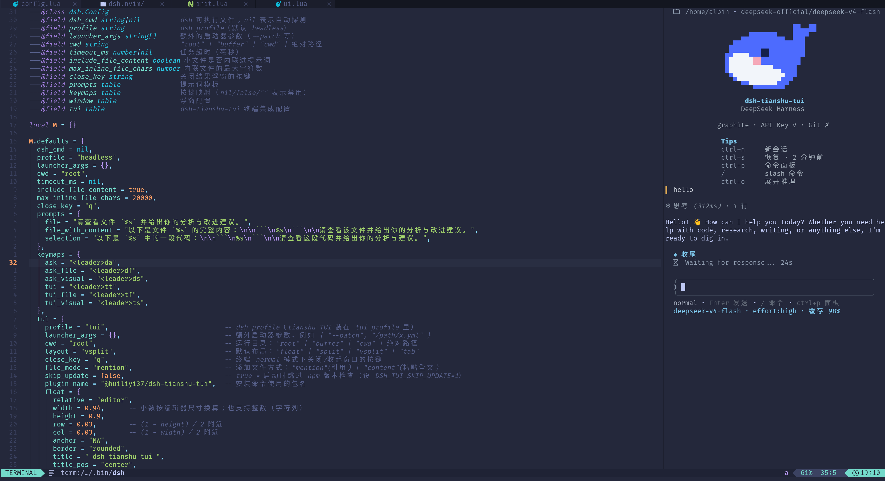

# dsh.nvim

_Bring the [DeepSeek Harness](https://github.com/deepseek-ai/deepseek-harness) (`dsh`) coding agent into your editor_

[](https://neovim.io)
[](./LICENSE)
[](https://github.com/AlbinZhu/dsh.nvim)

<div align="center">

**English** · [简体中文](./README.zh-CN.md)

</div>

## 📸 Screenshot

<p align="center">
  
</p>

`dsh.nvim` is a lightweight Neovim plugin that brings `dsh` into the editor, supporting two ways of working:

- **One-shot task mode** (`headless` profile): ask a question, review the current file, or send a visual selection to the AI agent from a floating window — the result is rendered directly in the float.
- **Interactive terminal TUI**: run [dsh-tianshu-tui](https://github.com/huiliyi37/dsh-tianshu-tui) (`dsh --profile tui`) inside a Neovim built-in `:terminal`, with `float` / `split` / `vsplit` / `tab` layouts and one-key toggle.

## ✨ Features

- 🪟 **Floating window interaction** — ask and read the result in one float; close with `q` / `<Esc>`
- 💬 **Three entry points** — ask directly, review the current file, or process a visual selection
- 🖥️ **dsh-tianshu-tui integration** — run the interactive TUI in a built-in `:terminal`, four layouts + toggle
- ⚡ **Works out of the box** — auto-detects the `dsh` binary (`PATH` → newest copy under `~/.npm/_npx`)
- 🧩 **Fully customizable** — prompt templates, working directory, timeout, window style, keymaps
- 🔌 **Lua API** — callable from other plugins or your config
- 🔧 **Neovim ≥ 0.10** — built on `vim.system` / `vim.fs`

## 📋 Requirements

- Neovim ≥ 0.10
- The `dsh` CLI from [DeepSeek Harness](https://github.com/deepseek-ai/deepseek-harness) (`@deepseek-ai/dsh`)

Install `dsh` by following [deepseek-harness](https://github.com/deepseek-ai/deepseek-harness), or just let the plugin auto-detect the copy under `~/.npm/_npx`.

To use the TUI, you also need to install the tianshu plugin into the `tui` profile (Node `^22.19 || >=24`, `pnpm` on `PATH`):

```sh
npx -y @deepseek-ai/dsh plugin --profile tui add @huiliyi37/dsh-tianshu-tui
```

You can also run `:DshTuiInstall` inside Neovim to do the same.

## 📦 Installation

### [lazy.nvim](https://github.com/folke/lazy.nvim)

```lua
{
  "AlbinZhu/dsh.nvim",
  lazy = false, -- tiny plugin; load it at startup
  config = function()
    require("dsh").setup()
  end,
}
```

Lazy-load on demand (optional):

```lua
{
  "AlbinZhu/dsh.nvim",
  event = "VeryLazy",
  config = function()
    require("dsh").setup()
  end,
}
```

### [packer.nvim](https://github.com/wbthomason/packer.nvim)

```lua
use({
  "AlbinZhu/dsh.nvim",
  config = function()
    require("dsh").setup()
  end,
})
```

### [vim-plug](https://github.com/junegunn/vim-plug)

```vim
Plug 'AlbinZhu/dsh.nvim'
" then in your config:
" lua require("dsh").setup()
```

## 🚀 Quick Start

| Command | Description |
|---|---|
| `:Dsh explain this project to me` | Ask directly |
| `:Dsh` | Ask via an input dialog |
| `:DshFile` | Review the current file |
| `:'<,'>DshSelection` | Send the visual selection |
| `:DshCancel` | Cancel the running job |

### 🖥️ dsh-tianshu-tui integration

| Command | Description |
|---|---|
| `:DshTui` | Toggle the TUI (default layout) |
| `:DshTui [text]` | Open the TUI and type text into its input line |
| `:DshTuiFloat` / `:DshTuiSplit` / `:DshTuiVSplit` / `:DshTuiTab` | Open the TUI in a specific layout |
| `:DshTuiFile [path]` | Add a file to the TUI input line (defaults to `@"path"` mention) |
| `:'<,'>DshTuiSelection` | Paste the selection into the TUI input line |
| `:DshTuiClose` | Close/hide the TUI window |
| `:DshTuiInstall` | Install the tianshu plugin into the `tui` profile |

_Default keymaps (registered in `setup()`, can be disabled):_

| Key | Action |
|---|---|
| `<leader>da` | Ask |
| `<leader>df` | Review file |
| `<leader>ds` (visual) | Send selection |
| `<leader>tt` | Toggle TUI |
| `<leader>tf` | Add file to TUI |
| `<leader>ts` (visual) | Add selection to TUI |

Inside the TUI terminal: press `<C-\><C-n>` to enter terminal normal mode, then `q` / `<Esc>` to hide the window; the TUI's own shortcuts (e.g. `Ctrl+Q` to quit) work directly in terminal job mode.

## ⚙️ Configuration

```lua
require("dsh").setup({
  dsh_cmd = nil,            -- path to the dsh executable; nil = auto-detect (PATH → newest copy in ~/.npm/_npx)
  profile = "headless",     -- dsh profile
  launcher_args = {},       -- extra launcher args, e.g. { "--patch", "/path/x.yml" }
  cwd = "root",             -- working directory: "root" (git root) | "buffer" | "cwd" | absolute path
  timeout_ms = nil,         -- task timeout (ms); nil = no limit
  include_file_content = true,
  max_inline_file_chars = 20000,
  close_key = "q",
  prompts = {
    file = "Please look at file `%s` and give your analysis and improvement suggestions.",
    file_with_content = "Here is the full content of file `%s`:\n\n```\n%s\n```\n\nPlease review the file and give your analysis and improvement suggestions.",
    selection = "Here is a piece of code from `%s`:\n\n```\n%s\n```\n\nPlease review this code and give your analysis and suggestions.",
  },
  keymaps = {
    ask = "<leader>da",
    ask_file = "<leader>df",
    ask_visual = "<leader>ds",
    tui = "<leader>tt",
    tui_file = "<leader>tf",
    tui_visual = "<leader>ts",
  },
  tui = {
    profile = "tui",            -- profile containing the tianshu TUI
    launcher_args = {},         -- extra launcher args, e.g. { "--patch", "/path/x.yml" }
    cwd = "root",               -- working directory: "root" | "buffer" | "cwd" | absolute path
    layout = "vsplit",          -- default layout: "float" | "split" | "vsplit" | "tab"
    close_key = "q",            -- key to close/hide the window in terminal normal mode
    file_mode = "mention",      -- how to add files: "mention" (reference) | "content" (paste full content)
    skip_update = false,        -- true = skip the npm version check at startup
    float = {
      relative = "editor",
      width = 0.94,             -- fractions are relative to the editor size; integers (character columns) are also accepted
      height = 0.9,
      row = 0.03,
      col = 0.03,
      anchor = "NW",
      border = "rounded",
      title = " dsh-tianshu-tui ",
      title_pos = "center",
      style = "minimal",
      focusable = true,
    },
    split = { position = "below", size = 0.4 },   -- position: "below" | "above"
    vsplit = { position = "right", size = 0.5 },  -- position: "right" | "left"
  },
  window = {
    relative = "editor",
    width = 0.72,           -- fractions are relative to the editor size; integers are also accepted
    height = 0.5,
    row = 0.25,             -- (1 - height) / 2, combined with anchor="NW" to center
    col = 0.14,             -- (1 - width) / 2
    anchor = "NW",
    border = "rounded",
    title = " dsh ",
    title_pos = "center",
    style = "minimal",
    focusable = true,
  },
})
```

- Set any entry in `keymaps` to `nil` / `false` / `""` to disable that mapping.
- Commands still work without calling `setup()` (defaults are used); only keymap registration is skipped.

## 🔌 Lua API

```lua
require("dsh").setup(opts)     -- configure + register keymaps
require("dsh").run(task)       -- run a task
require("dsh").ask(prompt?)    -- ask (opens an input dialog when no argument is given)
require("dsh").ask_file()      -- review the current file
require("dsh").ask_visual()    -- process the visual selection
require("dsh").cancel()        -- cancel the running task
require("dsh").open_tui(opts?) -- open/focus the TUI (opts: { layout, text })
require("dsh").toggle_tui(opts?) -- toggle the TUI
require("dsh").close_tui()     -- close/hide the TUI window
require("dsh").tui_install()   -- install the TUI plugin into the tui profile
require("dsh").tui_add_file(path?) -- add a file to the TUI (defaults to @mention)
require("dsh").tui_add_selection() -- paste the visual selection into the TUI
require("dsh").tui_paste(text) -- safely paste text using bracketed paste
require("dsh.tui").send(text)  -- send text to the TUI input line
```

## 🧠 How it works

The plugin ultimately runs:

```
dsh --profile headless -- "<task text>"
```

The `headless` mode writes only the last non-empty reply to stdout (exit code `0` on success, `1` on failure), so the float shows a spinner while running and renders the result once done; on error, stderr is shown as well.

The TUI integration runs:

```
dsh --profile tui
```

and puts that process into a Neovim built-in `:terminal` buffer (dsh-tianshu-tui is a full-screen interactive terminal app and cannot be treated like headless stdout collection). The process keeps running in the background while the window is hidden; toggling again reuses the same terminal.

Adding code/files to the TUI goes through the terminal's own input surface:

- Selected code is pasted wholesale into the input line using **bracketed paste** (`ESC[200~ … ESC[201~`) — multi-line code and escape characters are safe, and nothing gets submitted line by line;
- Files are referenced by default as `@"path"` **@mention**, which the TUI expands into a content summary on submit; set `tui.file_mode = "content"` to paste the full content instead.

Both only fill the input line without pressing Enter, so you can keep editing before submitting.

## ❓ FAQ

**Q: The first run is slow?**
The `headless` profile initializes on first use, so the first run takes a few extra seconds — this is normal.

**Q: "dsh not found"?**
The plugin probes in order: `dsh_cmd` → `PATH` → `~/.npm/_npx/*/node_modules/.bin/dsh`. If none of them work, specify it explicitly:

```lua
require("dsh").setup({ dsh_cmd = "/absolute/path/to/dsh" })
```

**Q: How do I close the result window?**
Press `q`, `<Esc>`, or `<C-c>`.

## 🗺️ Roadmap

- [x] Interactive terminal TUI integration (dsh-tianshu-tui)
- [ ] Streaming output (once dsh supports incremental output)
- [ ] Session / multi-turn conversation support (headless side; the TUI already has full session management)
- [ ] Write results into a split / quickfix

## 🤝 Contributing

Issues and PRs are welcome. Please keep the existing code style and make sure `require("dsh")` loads correctly.

## 📄 License

[MIT](./LICENSE) © 2026 AlbinZhu

## 🙏 Acknowledgements

Thanks to the [DeepSeek Harness](https://github.com/deepseek-ai/deepseek-harness) project.
